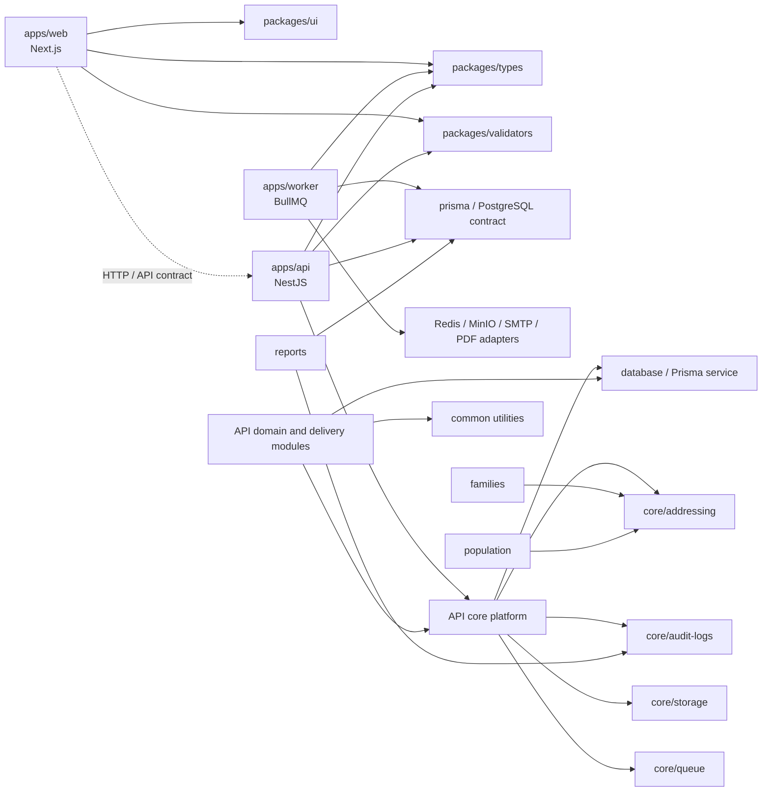
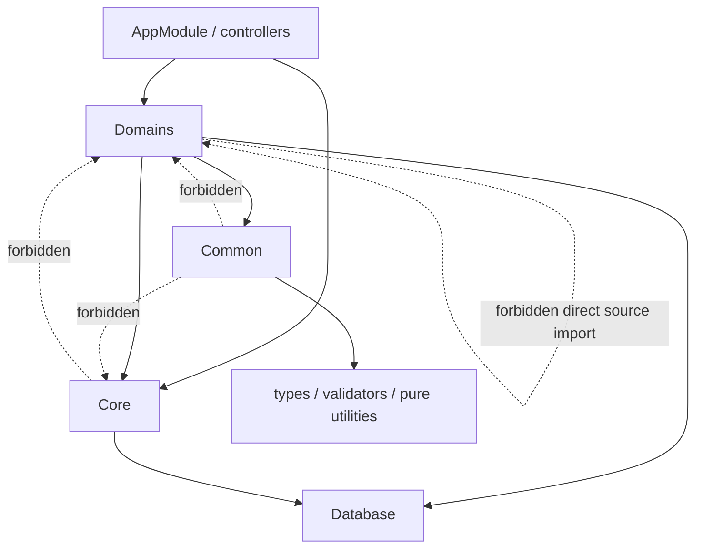
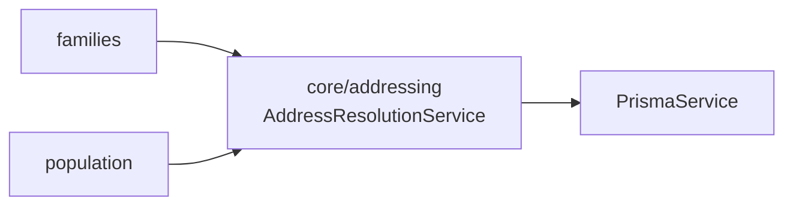

# AUDIT-1 — Dependency Graph Baseline

This graph records the intended dependency direction for the modular-monolith baseline. It describes runtime ownership, not every individual source import.



## API Layer Direction



## Verified Baseline Rules

| Source | Allowed targets | Explicitly rejected by CI |
| --- | --- | --- |
| `apps/web/src` | shared packages, HTTP/API contract | API and worker source paths |
| `apps/worker/src` | types, data/infrastructure adapters | web and API source paths |
| `apps/api/src/modules/*` | common, database, core, shared contracts | other domain module source paths |
| `apps/api/src/core/*` | database, common, shared contracts | domain module source paths |
| `apps/api/src/common/*` | shared contracts and pure utilities | core and domain source paths |
| `packages/*` | tooling/third-party packages and other non-app shared packages where justified | all deployable application source paths and manifests pointing at deployable apps |

## Reconciled Dependency

The baseline scanner identified `families → population` as a direct source dependency. The dependency existed only to resolve tenant-scoped address input. Both workflows now depend on the same core capability:



`PopulationService` no longer contains an address resolver. Resident create/update and family create/update use `AddressResolutionService`, which preserves tenant, hamlet, and RT/RW validation in one owned capability.

## Dependency-Map Source Review — 29 June 2026

**Revision reviewed:** `df36623615148124b7e52972712496b1f9bb0786` (PR #95 merge commit). The review is limited to repository source and CI configuration; it does not represent staging or production evidence.

| Map element | Reconciliation result |
| --- | --- |
| Application composition | The `AppModule` composition root contains every documented domain/delivery module and the documented core/platform modules. `AddressingModule` is consumed through `families` and `population`, which is consistent with a narrow exported core capability rather than a standalone root feature. |
| Core address ownership | `AddressingModule` exports `AddressResolutionService`; `FamiliesModule` and `PopulationModule` import it, and both services delegate embedded address input to the core service. |
| Domain isolation | The executable scanner walks the API, web, worker, and shared-package source roots. It rejects resolved relative and `@/` source edges that reverse the core/domain direction or create direct cross-domain module dependencies. |
| Read-model exception | `ReportsService` reads tenant-scoped counts and aggregates through `PrismaService` and uses `AuditLogsService`, without importing business-domain services. This remains the documented read-model exception. |
| Package/application isolation | The scanner also checks app-to-app source paths and shared-package manifests, so the graph's deployable-unit boundary is not documentation-only. |

**Review conclusion:** no new dependency node, undocumented source-import exception, or direct domain-to-domain source edge is added by this review. The graph remains accurate for the enforced static import policy.

### Evidence boundary

The graph is not a claim that runtime process wiring has been exercised. The scanner recognizes static `from`, literal `import()`, and literal `require()` calls; it cannot prove runtime Nest dependency injection, variable imports, queue behavior, storage/network calls, or deployed web/API/worker topology. Persistent staging evidence remains required before AUDIT-1 can be `Closed`.

### CI evidence coupling

The dedicated **AUDIT-1 Architecture Boundaries** workflow now also runs when this graph, the AUDIT-1 report, the audit master register, the roadmap, or `docs/ARCHITECTURE.md` changes. This keeps a documentation-driven status change paired with a fresh static source scan.

## Regeneration and Review

Run the executable boundary graph check locally:

```bash
pnpm audit:architecture
```

The static graph must be reviewed whenever a new deployable application, shared package, core service, or cross-domain contract is introduced. The executable test remains authoritative for import-policy enforcement.
