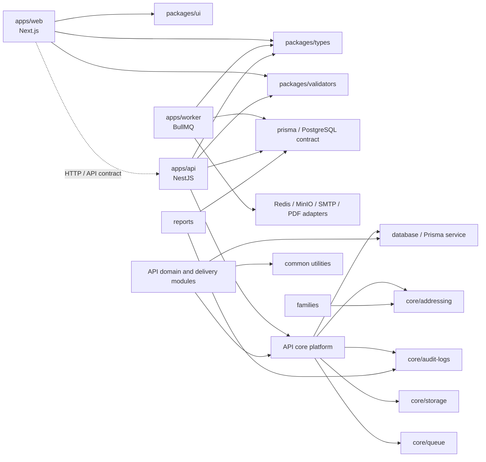
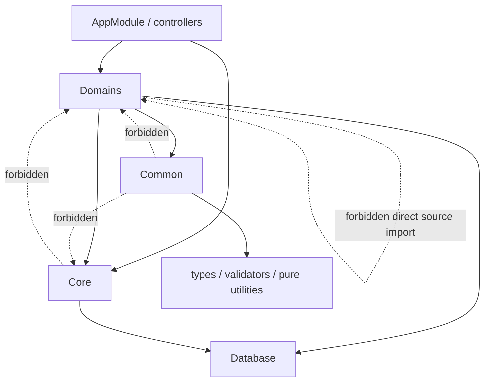
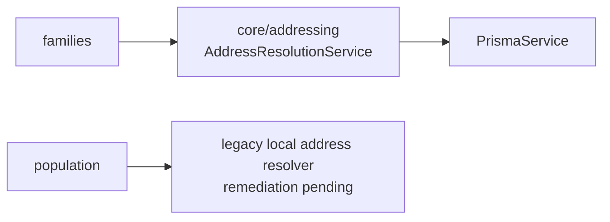

# AUDIT-1 — Dependency Graph Baseline

This graph records the intended dependency direction for the modular-monolith baseline. It describes runtime ownership, not every individual source import.



## API Layer Direction



## Verified Baseline Rules

| Source | Allowed targets | Explicitly rejected by CI |
| --- | --- | --- |
| `apps/web/src` | shared packages, HTTP/API contract | API and worker source paths |
| `apps/worker/src` | types, data/infrastructure adapters | web and API source paths |
| `apps/api/src/modules/*` | common, database, core, shared contracts | other domain module source paths |
| `apps/api/src/core/*` | database, common, shared contracts | domain module source paths |
| `apps/api/src/common/*` | shared contracts and pure utilities | core and domain source paths |
| `packages/*` | tooling/third-party packages and other non-app shared packages where justified | all deployable application source paths and manifests pointing at deployable apps |

## Reconciled Dependency

The baseline scanner identified `families → population` as a direct source dependency. The dependency existed only to resolve tenant-scoped address input. It is now replaced by:



`PopulationService` still contains a legacy local resolver. This is tracked as A1-P2 in the AUDIT-1 findings register; it is not an allowed direct domain dependency.

## Regeneration and Review

Run the executable boundary graph check locally:

```bash
pnpm audit:architecture
```

The static graph must be reviewed whenever a new deployable application, shared package, core service, or cross-domain contract is introduced. The executable test remains authoritative for import-policy enforcement.
